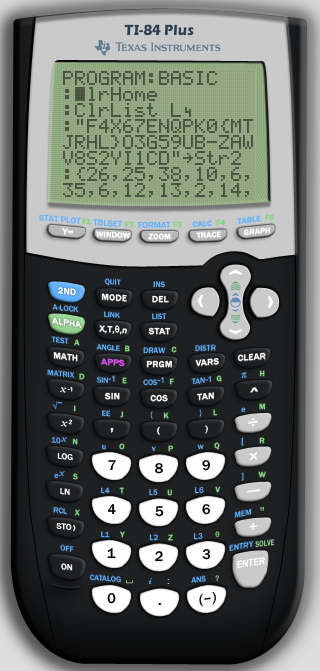

# BASIC

## Question

Get ready to go back to high school cause we're breaking out those graphing calculators! The ROM file is just to help run the challenge, you shouldn't have to reverse any of it. P.S. Remember that flags are case sensitive!

## Solution

I used an [online TI-84 emulator](https://www.cemetech.net/projects/jstified/) to load the provided program and view the source code:



Running the program produced an error so I replicated the logic in Python:

```python
s = 'F4X67ENQPK0{MTJRHL}O3G59UB-ZAWV8S2YI1CD'
nums = 26, 25, 38, 10, 6, 35, 6, 12, 13, 2, 14, 17, 27, 38, 18, 29, 23, 23, 27, 30, 2, 33, 27, 26, 11, 16, 37, 7, 22, 19
print(''.join(s[n - 1] for n in nums))
```

And this produced the expected result `BUCKEYE{M4TH-CLA55-W4S-B0R1NG}`.
