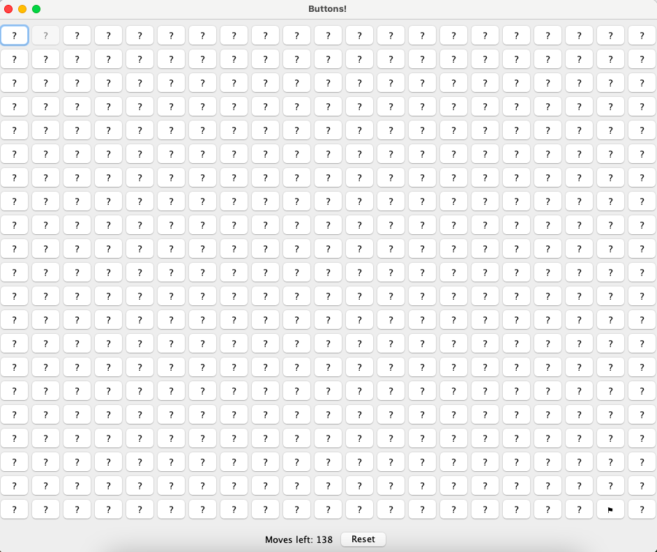

# Buttons

## Question

Anyone taken Software 1? Can you help me figure out what this weird Java program does?

## Solution

If run the provided Jar file then will see this grid with a hidden maze:



You can try and navigate through the maze but if make a wrong move then will be returned to the start.

To make the navigation easier I used a [Java decompiler](http://www.javadecompilers.com/) to convert the provided Jar in to Java and then modified the generated code so that each cell would display whether it was empty or a barrier:

```java
for (int i = 0; i < this.rows; ++i) {
    for (int j = 0; j < this.cols; ++j) {
        (this.buttons[i][j] = new JButton(String.valueOf(Buttons.grid[i][j]))).addActionListener(this);
        ...
    }
}
```

Once navigate correctly through the maze the following function will generate the flag from the history of moves:

```java
private void printFlag() {
    final BigInteger[] array = new BigInteger[this.moveHistory.size()];
    array[0] = BigInteger.valueOf(2L);
    for (int i = 1; i < array.length; ++i) {
        array[i] = array[i - 1].nextProbablePrime();
    }
    BigInteger val = BigInteger.valueOf(1L);
    final BigInteger m = new BigInteger("1430313837704837266267655033918654049072573502772041995300810633148485540425442305963378206448908414865491202671058946396326575688430628383447817933039379");
    for (int j = 0; j < this.moveHistory.size(); ++j) {
        val = val.multiply(array[j].modPow(BigInteger.valueOf(this.moveHistory.get(j)), m)).mod(m);
    }
    final String x = new String(new BigInteger("1181624346478884506978387685027501257422054115549381320819711748725513305918055802813085700551988448885328987653245675378090761255233757606571908411691314").multiply(val).mod(m).toByteArray(), StandardCharsets.UTF_8);
    System.out.println(x);
    JOptionPane.showMessageDialog((Component)this, x, "Flag", 1);
}
```

This then produced the expected result `buckeye{am4z1ng_j0b_y0u_b1g_j4va_h4ck3r}`.
